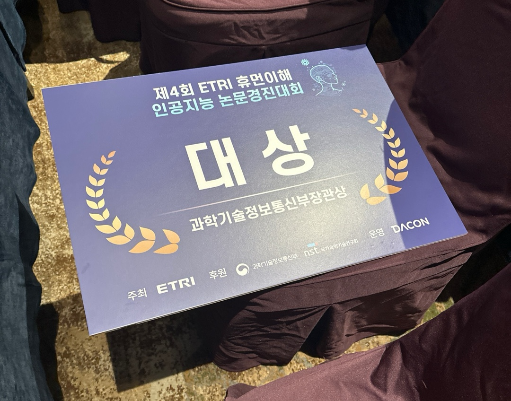

# 🧠 ETRI 라이프로그 기반 수면 건강 예측 AI 경진대회

> **Explainable Time-Series Feature Engineering for Sleep Quality Prediction Using Lifelog Data**  
> 📄 Published in **ICTC 2025**  
> (This repository contains code used in the Dacon competition; dataset and paper are not included due to copyright restrictions.)

---

## 🏆 대회 개요
- **대회명:** ETRI 라이프로그 데이터를 활용한 수면 품질 및 상태 예측 AI 경진대회  
- **주최:** ETRI (한국전자통신연구원) × Dacon  
- **대회 링크:** [https://dacon.io/competitions/official/236468/overview/description](https://dacon.io/competitions/official/236468/overview/description)  
- **설명:**  
  라이프로그 데이터(활동·심박·수면 등)를 활용하여 개인의 수면 관련 문항(Q1~Q3, S1~S3)을 예측하는 AI 모델 개발 과제

---

## ⚙️ 실행 환경

| 항목 | 내용 |
|------|------|
| OS | Ubuntu 22.04.3 LTS (VSCode Remote SSH from Windows 11) |
| Python | 3.11.11 |
| 주요 라이브러리 | numpy 1.26.4, pandas 2.2.2, scipy 1.13.1, scikit-learn 1.5.1, lightgbm 4.3.0, catboost 1.2.5, tqdm 4.66.4 등 |

---

## 📂 데이터

- **데이터 출처:** Dacon 공식 제공 (비공개)
- **형식:**
  - 센서 데이터: `.parquet` (`ch2025_data_items`)
  - 학습 라벨: `ch2025_metrics_train.csv`
  - 제출 샘플: `ch2025_submission_sample.csv`
- **주의:**  
  Dacon 및 ETRI의 데이터 저작권 정책에 따라 **원본 데이터는 공개 저장소에 포함하지 않습니다.**

---

## 🧩 데이터 처리 및 피처 엔지니어링

### 🔹 주요 파생 피처

| 구분 | 변수 예시 | 설명 |
|------|------------|------|
| 통계적 | mean, std, median | 구간별 기본 통계값 |
| 변동성 | IQR, MAD | 이상치 및 분산 반영 |
| 시계열 | diff, pct_change, EMA, expanding mean | 변화 추세 반영 |
| 패턴 탐지 | zero-crossing | 신호 부호 교차 횟수 |
| 날짜 기반 | dayofweek, month, hour, is_weekend, date_diff | 주기성 및 시간대 패턴 반영 |

### 🔹 집계 방식
- `subject_id` 기준 그룹화
- 피처별 `mean`, `std`, `min`, `max` 집계  
- 최종적으로 subject 단위 feature table 생성

---

## 🤖 모델 구조

| 항목 | 내용 |
|------|------|
| 대상 타깃 | Q1, Q2, Q3, S1, S2, S3 (총 6개) |
| 모델 구성 | **LightGBM + CatBoost 앙상블 (비율 0.3 : 0.7)** |
| 교차 검증 | Stratified K-Fold (5 folds, random_state=42) |
| 결측치 처리 | 수치형: -1 / 범주형: -1 |
| 평가 지표 | Macro F1-score |

### LightGBM 파라미터
```python
n_estimators = 1200
learning_rate = 0.045
class_weight = 'balanced'
force_col_wise = True
```

### CatBoost 파라미터
```python
iterations = 1200
learning_rate = 0.045
depth = 6
l2_leaf_reg = 4
early_stopping_rounds = 30
```

---

## 📈 예측 및 결과 생성

- 5개 폴드 예측 → Soft Voting 평균 → `argmax` 로 최종 결정  
- **최종 제출 파일:** `./data/submission_final_boost_timestrong.csv`  
- **컬럼 구성:**  
  `subject_id, sleep_date, lifelog_date, Q1, Q2, Q3, S1, S2, S3`

---

## 📊 성능
- **Public Leaderboard:** `Macro F1 ≈ 0.62555`  
- **모델 비중:** CatBoost(0.7) > LightGBM(0.3)  
  → CatBoost의 성능 기여도가 높음

---

## 🚀 실행 방법
```bash
# 1️⃣ 환경 세팅
pip install -r requirements.txt

# 2️⃣ 노트북 실행
jupyter notebook lifelog_analysis.ipynb
```

---

## 🧾 참고
- 본 연구 결과는 **ICTC 2025** 학회에  
  “*Explainable Time-Series Feature Engineering for Sleep Quality Prediction Using Lifelog Data*”  
  라는 제목으로 제출되었습니다.  
  (논문 전문은 비공개)

---

## 👤 작성자
- **팀명:** sch_csm  
- **참여 역할:** 데이터 처리 · 피처 엔지니어링 · 모델 설계 및 성능 개선  

---

## 🥇 수상 내역
- 과학기술정보통신부 장관상 (전국 1위)
- 예선·본선을 거쳐 최종 1위 달성



---

## 🏆 수상 소감
이번 ETRI 라이프로그 기반 수면 건강 예측 AI 경진대회를 통해 소중한 기회를 얻을 수 있어 진심으로 감사드립니다.
대회 기간 동안 단순한 성능 향상을 넘어, 데이터의 의미를 깊이 이해하고 문제를 해결하는 과정을 통해 많은 것을 배우고 성장할 수 있었습니다.

처음에는 쉽지 않은 도전이었지만, 꾸준히 시도하고 끝까지 포기하지 않으면서 결과를 만들어낼 수 있었습니다.
이 과정에서 협업의 중요성과 탐구의 즐거움을 다시 한 번 느낄 수 있었고, AI가 사람의 삶에 긍정적인 변화를 줄 수 있다는 확신도 더욱 강해졌습니다.

이번 경험을 발판 삼아 앞으로도 끊임없이 배우고 연구하며, 더 나은 인공지능 모델을 만들기 위해 노력하겠습니다.
배움의 자세를 잃지 않고, 도전을 즐기는 연구자로 계속 성장해 나가겠습니다.

📘 *본 저장소는 연구 재현을 위해 코드 중심으로 공개되었으며,  
데이터 및 논문 전문은 포함하지 않습니다.*
